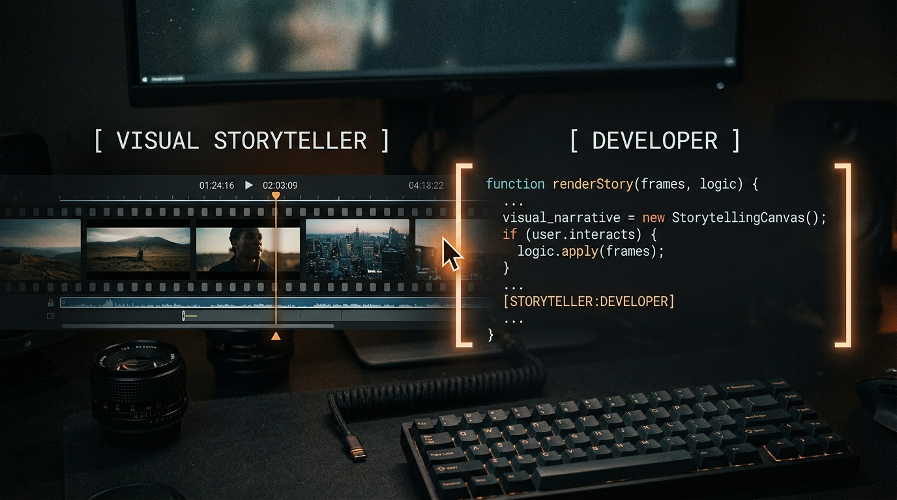

# Zabid Al Muttaki — Portfolio

The official personal portfolio of **Zabid Al Muttaki**, a hybrid Visual Storyteller and Software Developer based in Bangladesh.



## 🚀 Overview

This portfolio is built to showcase a unique intersection of skills: high-end cinematic video editing (DaVinci Resolve) and modern full-stack development. The site features a premium, brutalist aesthetic with custom interactive elements, smooth scrolling, and dynamic video integration.

## ✨ Features

- **Split-Identity Landing Page:** Interactive custom cursor that reveals different facets of the portfolio (Editor vs Developer).
- **Cinematic Video Integration:** Custom built modals to dynamically fetch and play maximum resolution YouTube/Vimeo embeds without leaving the site.
- **Project Intake System:** A streamlined `/contact` form that automatically structures client requests and routes them directly to WhatsApp for instant communication.
- **Premium Typography & UI:** Monospaced accents, brutalist typography scaling, and subtle CSS grid backgrounds.
- **Highly Performant:** Built on Next.js App Router for optimal SEO and loading speeds.

## 🛠️ Tech Stack

- **Framework:** [Next.js 14](https://nextjs.org/) (App Router)
- **Library:** [React](https://reactjs.org/)
- **Styling:** [Tailwind CSS](https://tailwindcss.com/)
- **Animations:** [Framer Motion](https://www.framer.com/motion/) & [Lenis](https://lenis.studiofreight.com/) (Smooth Scrolling)
- **Icons:** [Lucide React](https://lucide.dev/)

## 💻 Running Locally

To run this project on your local machine:

1. Clone the repository:
   ```bash
   git clone https://github.com/zabid-coder/zabid-portfolio-website.git
   ```
2. Navigate into the directory:
   ```bash
   cd zabid-portfolio-website
   ```
3. Install dependencies:
   ```bash
   npm install
   ```
4. Start the development server:
   ```bash
   npm run dev
   ```
5. Open [http://localhost:3000](http://localhost:3000) in your browser to see the result.

## 📬 Contact

- **GitHub:** [@zabid-coder](https://github.com/zabid-coder)
- **YouTube:** [Zabid Al Muttaki](https://www.youtube.com/@zabidalmuttaki3482)
- **LinkedIn:** Zabid Al Muttaki
